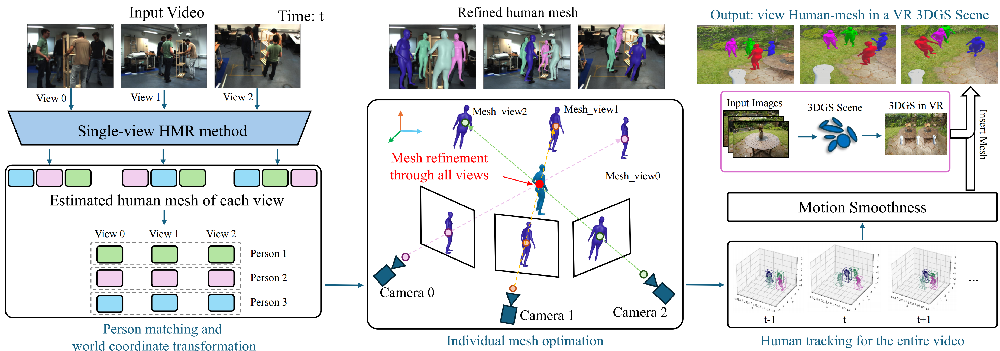

# Training-free Multi-view 4D Human Motion Reconstruction Virtual Reality System

## 1. Introduction



Human mesh recovery offers substantial potential for detailed behavior analysis and understanding of complex human-environment interactions. In this paper, we propose a novel 4D Human Motion Reconstruction Virtual Reality System that integrates advanced 4D multi-view human mesh recovery and high-quality 3D environment reconstruction using 3D Gaussian Splatting (3DGS). Our system seamlessly combines detailed 4D human behavior capture with accurate 3D environment reconstruction, significantly extending traditional visual monitoring approaches. Visualization through an interactive Virtual Reality (VR) platform enables dynamic interaction representation using accurately reconstructed virtual environments and computer-generated (CG) avatars. Experimental results from realistic scenarios validate the effectiveness of our framework in providing immersive experiences and precise human-environment modeling, demonstrating a significant advancement in a practical human-centered representation approach. Our approach consistently outperforms existing state-of-the-art methods, achieving reductions in mesh errors of 24\% in PVE and 32\% in MPJPE on the CHI3D dataset, and 17\% in MPJPE and 64\% in translation error on the Hi4D dataset compared to other multi-view methods.

## 2. Setup

### 2.1 Environment

1. Please follow [MultiHMR](https://github.com/naver/multi-hmr) to set up your python virtual environment.
2. Install ffmpeg in the env created above.

### 2.2 Dataset

Please see [Dataset Setup](docs/data.md) page for details.

## 2.3 Pre-trained Checkpoints

**Multi-HMR Pre-trained Checkpoints**

Please download from [MultiHMR](https://github.com/naver/multi-hmr). Place all files under `checkpoints/multiHMR`.

- multiHMR_896_L HuggingFace model (support zero-shot)
- multiHMR_672_L
- multiHMR_672_S (support zero-shot)

**Our Multi-HMR Checkpoints (finetuned on CHI3D/Hi4D)**

Please download our checkpoints from [Google Drive](). Place all files under `checkpoints/saved`.

## 2.4 SMPL/SMPL-X

**SMPL**

Please download the following files from [SMPL](https://smpl.is.tue.mpg.de/index.html).

- `SMPL_NEUTRAL.npz`: place under `models/smpl`.

**SMPL-X**

Please download the following files from [SMPL-X](https://smpl-x.is.tue.mpg.de/index.html).

- `SMPLX_NEUTRAL.npz`: place under `models/smplx`.

## 2.5 Other Support Files

Please download from [Google Drive]().

- `J_regressor_h36m.npy`: place under `models`.
- `smpl_mean_params.npz`: place under `models`.
- `smplx2smpl.pkl`: place under `models/smplx`.


## 3. Usage

### 3.1 Single-view Fine-tuning 

**CHI3D**

Please replace `<YOUR_CHI3D_DATASET_PATH>` to your downloaded CHI3D data path.

```
python train.py --exp_name model_large_672_chi3d_sv \
    --dataset chi3d \
    --dataset_dir <YOUR_CHI3D_DATASET_PATH> \
    --pretrained_path models/multiHMR/multiHMR_672_L.pt \
    --smplx_dir models \
    --smplx2smpl_path models/smplx/smplx2smpl.pkl \
    --j_regressor_h36m_path models/J_regressor_h36m.npy \
    --image_size 672 \
    --train_batchsize 8 \
    --epochs 5 \
    --backbone dinov2_vitl14 \
    --smplx_type smplx \
    --save_dir checkpoints/saved \
    --device 0
```

**Hi4D** (working in progress)

Please replace `<YOUR_HI4D_DATASET_PATH>` to your downloaded Hi4D data path.

```
python train.py --exp_name model_large_672_hi4d_sv \
    --dataset hi4d \
    --dataset_dir <YOUR_HI4D_DATASET_PATH> \
    --pretrained_path models/multiHMR/multiHMR_672_L.pt \
    --smplx_dir models \
    --smplx2smpl_path models/smplx/smplx2smpl.pkl \
    --j_regressor_h36m_path models/J_regressor_h36m.npy \
    --image_size 672 \
    --train_batchsize 8 \
    --epochs 5 \
    --backbone dinov2_vitl14 \
    --smplx_type smpl \
    --save_dir checkpoints/saved \
    --device 0
```

### 3.2 Evaluation on CHI3D / Hi4D

**CHI3D**

Please replace `<YOUR_CHI3D_DATASET_PATH>` to your downloaded CHI3D data path.

```
python test.py --exp_name model_large_672_chi3d_sv \
    --dataset chi3d \
    --dataset_dir <YOUR_CHI3D_DATASET_PATH \
    --pretrained_path models/multiHMR/multiHMR_672_L.pt \
    --smplx_dir models \
    --smplx2smpl_path models/smplx/smplx2smpl.pkl \
    --j_regressor_h36m_path models/J_regressor_h36m.npy \
    --image_size 672 \
    --backbone dinov2_vitl14 \
    --smplx_type smplx \
    --data_smplx_type smplx \
    --eval_mode finetune \
    --save_dir ./checkpoints/saved \
    --recenter \
    --device 0
```

**Hi4D** (working in progress)

Please replace `<YOUR_HI4D_DATASET_PATH>` to your downloaded Hi4D data path.

```
python test.py --exp_name model_large_672_hi4d_sv \
    --dataset hi4d \
    --dataset_dir <YOUR_HI4D_DATASET_PATH> \
    --pretrained_path models/multiHMR/multiHMR_672_L.pt \
    --smplx_dir models \
    --smplx2smpl_path models/smplx/smplx2smpl.pkl \
    --j_regressor_h36m_path models/smplx/smplx2smpl.pkl \
    --image_size 672 \
    --backbone dinov2_vitl14 \
    --smplx_type smpl \
    --data_smplx_type smpl \
    --eval_mode finetune \
    --save_dir checkpoints/saved \
    --device 0
```

### 3.3 Demo Quick Start

Please see [Quick Start](docs/demo.md) page for details.

### 3.4 Inference on Custom Dataset

Please see [Dataset Setup](docs/data.md) page for details.

## 4. Qualitative Results

Please see [Visualization](docs/visualization.md) page for details.

## 5. Quantitative Results

### 5.1 HMR Metrics

**CHI3D-Zeroshot**

| No. | Experiment | HMR Model | MPJPE | PA-MPJPE | PVE | PA-PVE | Transl. | Precision | Recall | F1-score |
| -- | -- | -- | -- | -- | -- | -- | -- | -- | -- | -- |
| 1 | Full | MultiHMR-Large-896 | 49.68 | 30.95 | 51.24 | 31.55 | 34.32 | 99.21 | 99.23 | 99.22 |
| 2 | Full | MultiHMR-Small-672 | 56.13 | 38.22 | 58.36 | 38.70 | 39.60 | 98.26 | 98.94 | 98.60 |
| 3 | Full (w/o lowest mpjpe) | MultiHMR-Small-672 | 64.33 | 42.93 | 69.09 | 44.95 | 39.75 | 98.29 | 98.84 | 98.57 |
| 4 | Full (w/o recenter) | MultiHMR-Small-672 | 68.63 | 42.39 | 71.53 | 43.15 | 87.93 | 93.58 | 98.35 | 95.91 |

**Hi4D-Zeroshot**

| No. | Experiment | HMR Model | MPJPE | PA-MPJPE | PVE | PA-PVE | Transl. | Precision | Recall | F1-score |
| -- | -- | -- | -- | -- | -- | -- | -- | -- | -- | -- |
| 1 | Full | MultiHMR-Large-896 | 68.04 | 40.09 | 77.42 | 52.15 | 40.51 | 96.77 | 99.51 | 98.12 |
| 7 | Full | MultiHMR-Small-672 | 80.18 | 52.52 | 91.86 | 68.01 | 67.04 | 97.77 | 96.39 | 97.07 |
| 3 | Full (w/o lowest mpjpe) | MultiHMR-Small-672 | 92.39 | 59.36 | 108.46 | 79.39 | 60.68 | 97.05 | 95.60 | 96.32 |
| 4 | Full (2 cam) | MultiHMR-Small-672 | 87.23 | 56.43 | 101.61 | 74.25 | 72.08 | 98.02 | 96.41 | 97.21 |
| 5 | Full (3 cam) | MultiHMR-Small-672 | 83.30 | 53.34 | 96.20 | 69.60 | 66.67 | 97.91 | 94.98 | 96.43 |
| 6 | Full (4 cam) | MultiHMR-Small-672 | 83.03 | 53.14 | 95.10 | 68.52 | 61.74 | 96.43 | 96.66 | 96.55 |
| 2 | Full (w/o recenter) | MultiHMR-Small-672 | 83.20 | 52.81 | 94.47 | 68.09 | 59.07 | 96.70 | 96.70 | 96.70 |

**CHI3D-finetuned**

| No. | Experiment | HMR Model | MPJPE | PA-MPJPE | PVE | PA-PVE | Transl. | Precision | Recall | F1-score |
| -- | -- | -- | -- | -- | -- | -- | -- | -- | -- | -- |
| 1 | Full | MultiHMR-Large-672 | 28.13 | 20.12 | 31.35 | 22.65 | 18.10 | 99.83 | 99.86 | 99.85 |
| 2 | Full | MultiHMR-Small-672 | 32.67 | 24.03 | 36.12 | 26.46 | 21.76 | 99.80 | 99.71 | 99.75 |
| 3 | Full (w/o lowest mpjpe) | MultiHMR-Large-672 | 32.55 | 24.10 | 36.85 | 27.29 | 17.98 | 99.90 | 99.82 | 99.86 |
| 4 | Full (Agglomerative Clustering) | MultiHMR-Large-672 | 28.16 | 20.13 | 31.39 | 22.66 | 18.10 | 99.80 | 99.93 | 99.87 |


**Hi4D-finetuned**

| No. | Experiment | HMR Model | MPJPE | PA-MPJPE | PVE | PA-PVE | Transl. | Precision | Recall | F1-score |
| -- | -- | -- | -- | -- | -- | -- | -- | -- | -- | -- |
| 1 | Full | MultiHMR-Large-672 | 42.26 | 27.58 | 48.63 | 35.08 | 21.83 | 100.00 | 100.00 | 100.00 |
| 2 | Full | MultiHMR-Small-672 | 51.00 | 36.92 | 59.72 | 45.15 | 26.62 | 99.93 | 99.98 | 99.95 |
| 3 | Full (w/o lowest mpjpe) | MultiHMR-Large-672 | 50.53 | 34.71 | 60.50 | 46.30 | 21.83 | 100.00 | 100.0 | 100.00 |
| 4 | Full (2 cam) | MultiHMR-Large-672 | 47.37 | 31.69 | 56.31 | 41.74 | 31.25 | 100.0 | 98.95 | 99.47 |
| 5 | Full (3 cam) | MultiHMR-Large-672 | 45.68 | 30.40 | 53.70 | 39.48 | 28.06 | 99.98 | 99.28 | 99.63 |
| 6 | Full (4 cam) | MultiHMR-Large-672 | 43.56 | 28.52 | 50.52 | 36.59 | 24.02 | 99.95 | 99.89 | 99.92 |

### 5.2 Time Complexity

5 views on Tesla V100

**MultiHMR-Small-672**

- Inference time: 61.12081336975098 ms
- FPS: 16.361038815869318

**MultiHMR-Large-672**

- Inference time: 244.543958902359 ms
- FPS: 4.08924434072517

## 6. Limitation

Our approach use `K-Means` on human joints to perform cross-view human matching, which means the number of human in the scene need to be x fixed value in the whole sequence. We are working on another new cross-view method which allow the input with uncertain number of humans.

## TODO

- [x] CHI3D single-view fine-tuning support
- [x] CHI3D evaluation support
- [x] CHI3D demo support
- [ ] Hi4D single-view fine-tuning support
- [ ] Hi4D evaluation support
- [ ] Hi4D demo support
- [x] Panoptic demo support
- [ ] Shelf demo support
- [ ] Documentation

## References

[1] MultiHMR: https://github.com/naver/multi-hmr

